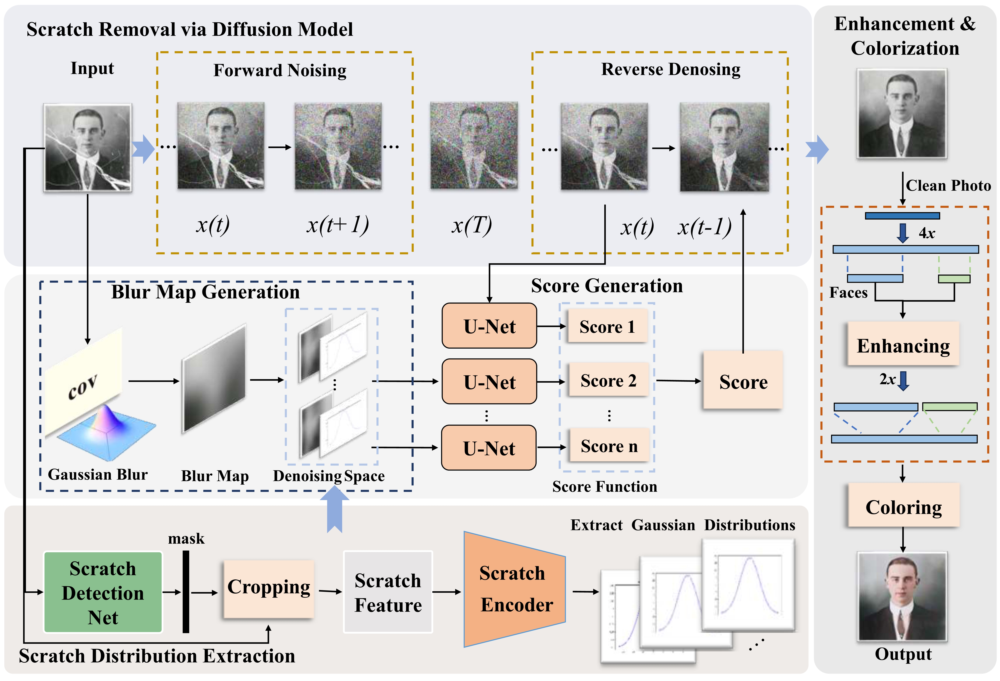

## [Old scratched photos restoration with enhancement and colorization](https://link.springer.com/article/10.1007/s11042-024-19595-w)

### The result of historical materials restoration reflects the temperature of AI:

### [Abstract]
Although the current deep learning-based old photos restoration work can repair scratches and structural defects, the results often have the problems of incomplete scratch detection and poor repair quality. In order to solve these problems synthetically, in this paper, we use the way of modeling the degradation information of the scratched areas and generate contents to fill them. We proposed a framework to restore old scratched photos, in which we fully exploit and preserve the available information from the deteriorated photos, enabling us to accomplish image quality restoration and colorization with utmost finesse based on this invaluable data. Our proposed framework consists of two modules: a scratch removal module for old photos based on a Fine-tune and Guided the diffusion model, an Image enhancement and colorization module. To make full use of scratches feature information, we introduce a scratch distribution extraction (ScDE) module to learn the scratch model as Gaussian noise distributions. Through the fine-tuning the path of reverse denoising, it will eventually move towards the data distribution without scratches. Therefore, our proposed method can efficiently remove scratches from degraded old photos while maintaining the original styles of scratch-free regions. At the same time, most old photos after scanning have the problem of low resolution and blurriness, the efficacy of our image quality enhancement and Colorization strategy in resolving this issue is commendable. The comprehensive experimental results show that our image enhancement and colorization module can render the structural features of the image clearer and more realistic. Furthermore, we construct a large-scale old-photo-scratch-dataset (ScraOld) involved various scene classes with 703 pairs of scratched photos and their ground-truth. Experimental results demonstrate that our proposed method achieve the state-of-the-art (SOTA) performance in terms of PSNR, SSIM, LPIPS, FID metrics. The subjective quality is significantly higher than all comparison methods.

## Getting Started 
### Dependencies
Below is the key environment under which the code was developed, not necessarily the minimal requirements:

1. Python 3.9
2. pytorch 1.8.1
3. cuda 10.1

And other libraries such as numpy, cv2 ......

### Prepare data
Dataset: Due to copyright issues of photography and historical materials, we choose not to open the dataset, but you can contact us by email, and we will do our best to provide the dataset and pre-trained model.

1: In consequence, we gathered a sizable collection of authentic old images and added random scratches to them to mimic scratches. In this way we generate scratched old photos in Ground Truth. 

2: Secondly, we obtain the corresponding clean pictures by manually repairing the old photos with real scratches. We invited experts in the field of art and design to repair real scratched old photos, and each photo was individually restored by multiple people, then voted the best one of them. Afte that, in this way we obtain our expected Ground Truth from real scratched old photos. 

Intotal, we produced 593 pairs for the training-set, and 110 pairs for the test-set. And we name it ScraOld.

### Train
python train.py -opt=options/train/descratch.yml

The Scde module can be trained independently. 

### Test
python test.py '-opt=options/test/descratch.yml'

The weight of the ScdE module guidance can be changed in the sde_utils.py 

### Authors
Sheng Wang (Hubei University)

Dr. Xin Ding (Huazhong University of Science and Technology)

Prof. Wei Zhang(Hubei University)

Sheng Wang, silenceWang6@gmail.com

### Contact
If you have any questions, please contact me: Sheng Wang(silenceWang6@gmail.com)

### Citation (Bibtex)
Please cite our paper if you find it useful:

      @article{wang2024old,
        title={Old scratched photos restoration with enhancement and colorization},
        author={Wang, Sheng and Ding, Xin and Zhang, Wei},
        journal={Multimedia Tools and Applications},
        pages={1--19},
        year={2024},
        publisher={Springer}
      }
